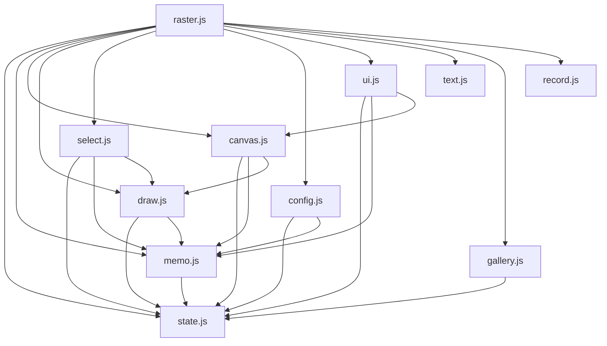

# Design Document — Sabak Enhancements

## Overview

This document describes the technical design for three enhancements to the Sabak HTML5 Canvas whiteboard:

1. **Extended Shape Tools** — six new geometric shapes (triangle, diamond, star, arrow, pentagon, hexagon) added to `js/draw.js`.
2. **Selection Tool** — a new `js/select.js` module that lets users select a canvas region using any shape boundary, then move or delete it.
3. **Config Modal** — a new `js/config.js` module providing a Bootstrap modal for runtime image-format detection and undo/redo stack-size configuration.

All three features integrate with the existing ES-module architecture (jQuery v4, Bootstrap v5 dark theme, left sidebar, header action bar) and share the central `js/state.js` state object.

---

## Architecture

### Module Dependency Graph



### Key Architectural Decisions

**Shared shape-path functions in `draw.js`**: All six new shape renderers are implemented as pure path-building functions exported from `draw.js`. Both the draw tool (for committing to the main canvas) and the selection tool (for drawing the dashed overlay on the ghost canvas) call the same path functions. This eliminates duplication and guarantees that the selection boundary matches the drawn shape exactly.

**`js/select.js` as a self-contained module**: The selection tool owns its own state (anchor point, active selection region, copied pixel buffer, shape mode) and registers its own pointer event handlers. The entry point (`raster.js`) dispatches pointer events to `select.js` when `state.tool === "select"`, the same pattern used for the text tool today.

**`js/config.js` as a self-contained module**: Config owns the Bootstrap modal lifecycle, the runtime format probe, and the apply/cancel logic. It writes confirmed values into `state` and calls a `memo.js` API to resize the stacks.

**`state.js` additions**: Three new fields are added to the shared state object — `imageFormat` (string, default `"image/webp"`), `stackSize` (number, default `10`), and `selectShapeMode` (string, default `"rect"`). No existing fields are renamed or removed.

**`memo.js` dynamic MAX**: The module-level `MAX` constant becomes a mutable variable driven by `state.stackSize`. A new exported function `setStackSize(n)` updates it and trims both stacks if needed.

---

## Components and Interfaces

### 1. `js/state.js` — Extended State

```js
export const state = {
    // existing fields unchanged …
    canvas:     null,
    sbk:        null,
    tool:       "pen",
    color:      "#ffffff",
    lineWidth:  2,
    isDrawing:  false,
    recordMode: "stream",
    fontFace:   "sans-serif",
    fontSize:   20,

    // NEW
    imageFormat:     "image/webp",   // active MIME type for all toDataURL calls
    stackSize:       10,             // current max undo/redo stack depth (9–99)
    selectShapeMode: "rect",         // active shape for the selection tool
};
```

### 2. `js/draw.js` — Extended Shape Rendering

#### New exported path functions

Each function accepts a 2D rendering context and a bounding box `(x1, y1, x2, y2)` and builds a path on that context. They do **not** call `stroke()` or `fill()` — the caller is responsible for styling and stroking. This makes them reusable for both drawing and selection overlays.

```js
export function pathTriangle(ctx, x1, y1, x2, y2)  { … }
export function pathDiamond(ctx, x1, y1, x2, y2)   { … }
export function pathStar(ctx, x1, y1, x2, y2)      { … }
export function pathArrow(ctx, x1, y1, x2, y2)     { … }
export function pathPentagon(ctx, x1, y1, x2, y2)  { … }
export function pathHexagon(ctx, x1, y1, x2, y2)   { … }
```

A dispatch map is used internally and exported for reuse:

```js
export const SHAPE_PATH_FNS = {
    triangle: pathTriangle,
    diamond:  pathDiamond,
    star:     pathStar,
    arrow:    pathArrow,
    pentagon: pathPentagon,
    hexagon:  pathHexagon,
    rect:     (ctx, x1, y1, x2, y2) => ctx.rect(x1, y1, x2 - x1, y2 - y1),
    circle:   (ctx, x1, y1, x2, y2) => {
        const cx = (x1 + x2) / 2, cy = (y1 + y2) / 2;
        ctx.ellipse(cx, cy, Math.abs(x2 - x1) / 2, Math.abs(y2 - y1) / 2, 0, 0, Math.PI * 2);
    },
    line:     (ctx, x1, y1, x2, y2) => { ctx.moveTo(x1, y1); ctx.lineTo(x2, y2); },
};
```

The existing `onMove` and `onUp` handlers are updated to look up the active tool in `SHAPE_PATH_FNS` instead of using `if/else` chains.

#### Shape geometry specifications

| Shape | Construction |
|---|---|
| **Triangle** | Apex at `(cx, y1)`, base-left at `(x1, y2)`, base-right at `(x2, y2)` where `cx = (x1+x2)/2`. |
| **Diamond** | Four vertices: top `(cx, y1)`, right `(x2, cy)`, bottom `(cx, y2)`, left `(x1, cy)` where `cy = (y1+y2)/2`. |
| **Star** | Five outer points on a circle of radius `r = min(w,h)/2`, five inner points at `r * 0.382`, rotated so the first outer point is at the top. Centre at `(cx, cy)`. |
| **Arrow** | Built in local coordinates with the shaft running along the positive x-axis, then transformed to align with the drag vector. See arrow rendering detail below. |
| **Pentagon** | Five vertices equally spaced on a circle of radius `r = min(w,h)/2`, first vertex at top (`-π/2`). Centre at `(cx, cy)`. |
| **Hexagon** | Six vertices equally spaced on a circle of radius `r = min(w,h)/2`, first vertex at top (`-π/2`). Centre at `(cx, cy)`. |

#### Arrow rendering detail

The arrow path is constructed in local (pre-rotation) coordinates where the shaft runs along the positive x-axis, then a canvas transform is applied to align it with the actual drag vector:

```js
function pathArrow(ctx, x1, y1, x2, y2) {
    const dx    = x2 - x1;
    const dy    = y2 - y1;
    const len   = Math.hypot(dx, dy);
    const angle = Math.atan2(dy, dx);   // drag vector angle

    const hw  = Math.min(len * 0.35, 30);  // arrowhead width (half-height)
    const hl  = Math.min(len * 0.4,  40);  // arrowhead length
    const sw  = Math.max(len * 0.12,  4);  // shaft half-height

    // Build path in local coords: shaft along x-axis from (0,0) to (len,0)
    ctx.save();
    ctx.translate(x1, y1);
    ctx.rotate(angle);

    ctx.beginPath();
    ctx.moveTo(0,        -sw);
    ctx.lineTo(len - hl, -sw);
    ctx.lineTo(len - hl, -hw);
    ctx.lineTo(len,        0);
    ctx.lineTo(len - hl,  hw);
    ctx.lineTo(len - hl,  sw);
    ctx.lineTo(0,         sw);
    ctx.closePath();

    ctx.restore();
    // Caller applies stroke/fill after restore
}
```

`ctx.save()` preserves the current transform, `ctx.translate(x1, y1)` moves the origin to the drag start, `ctx.rotate(angle)` aligns the x-axis with the drag vector, and `ctx.restore()` returns the context to its prior state after the path is built. The caller then calls `ctx.stroke()` (or `ctx.fill()`) on the resulting path.

#### Ghost canvas accessors (new additions)

The current `draw.js` source exports `initGhost` and `resizeGhost` but does **not** export `getGhostCtx`, `getGhost`, or `clearGhost`. These three functions are **new additions** that must be implemented as part of this feature. They give `select.js` access to the ghost canvas without duplicating the canvas reference:

```js
// NEW — must be added to draw.js
export function getGhostCtx() { return gctx; }
export function getGhost()    { return ghost; }
export function clearGhost()  { gctx.clearRect(0, 0, ghost.width, ghost.height); }
```

`select.js` imports these three functions from `draw.js` to render the selection overlay and clear it.

### 3. `js/select.js` — Selection Tool

#### Module-level state

```js
let anchorX = 0, anchorY = 0;       // mousedown point
let curX    = 0, curY    = 0;       // current pointer position
let isSelecting  = false;           // drag in progress
let hasSelection = false;           // selection finalised
let selX1 = 0, selY1 = 0;          // bounding box of finalised selection
let selX2 = 0, selY2 = 0;
let freeformPath = [];              // [{x,y}] for pen/freeform mode
let copiedPixels = null;            // ImageData of the copied region
let isDraggingMove = false;         // move drag in progress
let moveOffsetX = 0, moveOffsetY = 0;
```

#### Exported API

```js
export function onSelectDown(e)   { … }
export function onSelectMove(e)   { … }
export function onSelectUp(e)     { … }
export function onSelectLeave()   { … }
export function deleteSelection() { … }
export function cancelSelection() { … }
export function initSelectTool()  { … }
```

#### Selection overlay rendering

The overlay is drawn on the ghost canvas using a dashed stroke:

```js
function drawOverlay() {
    const ctx = getGhostCtx();
    clearGhost();
    ctx.save();
    ctx.setLineDash([6, 4]);
    ctx.strokeStyle = "#fff";
    ctx.lineWidth   = 1.5;
    ctx.globalCompositeOperation = "source-over";

    if (state.selectShapeMode === "pen") {
        // freeform path
        ctx.beginPath();
        freeformPath.forEach((pt, i) => i === 0 ? ctx.moveTo(pt.x, pt.y) : ctx.lineTo(pt.x, pt.y));
        ctx.stroke();
    } else {
        const fn = SHAPE_PATH_FNS[state.selectShapeMode];
        ctx.beginPath();
        fn(ctx, anchorX, anchorY, curX, curY);
        ctx.stroke();
    }
    ctx.restore();
}
```

#### Move operation

1. On move-initiation: `copiedPixels = state.sbk.getImageData(selX1, selY1, w, h)`.
2. Fill vacated area with `BG_COLOR`:
   - **Rectangular selections**: `state.sbk.fillStyle = BG_COLOR; state.sbk.fillRect(selX1, selY1, w, h)`.
   - **Non-rectangular selections** (circle, triangle, diamond, star, arrow, pentagon, hexagon, freeform): `ctx.save()`, build the shape path using the same `SHAPE_PATH_FNS` function (or freeform path), call `ctx.clip()` to restrict drawing to the shape boundary, then `ctx.fillRect(selX1, selY1, w, h)` to fill only the clipped region with `BG_COLOR`, then `ctx.restore()`.
3. During drag: render `copiedPixels` on the ghost canvas at the current drag offset.
4. On drop: composite the copied pixels back onto the main canvas:
   - **Rectangular selections**: `state.sbk.putImageData(copiedPixels, dropX, dropY)`.
   - **Non-rectangular selections**: `ctx.save()`, translate to `(dropX, dropY)`, build the shape path (offset to local origin), call `ctx.clip()`, then `ctx.drawImage` from an offscreen canvas holding `copiedPixels`, then `ctx.restore()`. This ensures only pixels within the shape boundary are composited, preserving the existing canvas content outside the shape at the drop location.
5. Clear ghost canvas, push snapshot to undo stack via `pushUndo()`.

#### Sidebar sub-panel

A `<div id="select_shape_panel">` is added to the sidebar HTML, hidden by default. It contains shape-mode buttons (same icons as the shape tool buttons). `initSelectTool()` wires up:

- Show/hide the panel based on `state.tool`.
- Shape-mode button clicks update `state.selectShapeMode`.
- Delete button and keyboard shortcut (`Delete`/`Backspace`) call `deleteSelection()`.
- `Escape` calls `cancelSelection()`.

### 4. `js/config.js` — Config Modal

#### Runtime format detection

```js
const CANDIDATE_FORMATS = [
    "image/webp",
    "image/png",
    "image/jpeg",
    "image/avif",
];

export function detectSupportedFormats() {
    const probe = document.createElement("canvas");
    probe.width = probe.height = 1;
    return CANDIDATE_FORMATS.filter(fmt => {
        const url = probe.toDataURL(fmt);
        // A non-supported format falls back to "data:image/png;base64,..."
        return url.startsWith("data:" + fmt);
    });
}
```

#### Modal lifecycle

```js
export function initConfig() {
    const $btn   = $("#btn_config");
    const $modal = $("#configModal");
    let bsModal  = null;

    $btn.on("click", () => {
        populateModal();
        if (!bsModal) bsModal = new bootstrap.Modal($modal[0]);
        bsModal.show();
    });

    $("#config_apply").on("click", applyConfig);
    // Cancel / dismiss: Bootstrap handles hide; no state changes needed.
}

function populateModal() {
    // Reflect current state into controls (requirement 3.10)
    $("#config_format_select").val(state.imageFormat);
    $("#config_stack_size").val(state.stackSize);
}

function applyConfig() {
    const fmt  = $("#config_format_select").val();
    const size = parseInt($("#config_stack_size").val(), 10);
    if (fmt)  state.imageFormat = fmt;
    if (size >= 9 && size <= 99) setStackSize(size);
    bootstrap.Modal.getInstance($("#configModal")[0]).hide();
}
```

#### HTML additions

**Header** — Config button inserted before the Info button:

```html
<button class="hbtn" id="btn_config" title="Konfigurasi">
    <i class="bi bi-gear"></i><span>Config</span>
</button>
```

**Config Modal** — Bootstrap modal at end of `<body>`:

```html
<div class="modal fade" id="configModal" tabindex="-1" aria-labelledby="configModalLabel" aria-hidden="true">
  <div class="modal-dialog modal-dialog-centered">
    <div class="modal-content bg-dark border-secondary">
      <div class="modal-header border-secondary">
        <h6 class="modal-title" id="configModalLabel">
          <i class="bi bi-gear"></i> Konfigurasi
        </h6>
        <button type="button" class="btn-close btn-close-white" data-bs-dismiss="modal" aria-label="Tutup"></button>
      </div>
      <div class="modal-body">
        <div class="mb-3">
          <label class="form-label small text-secondary">Format Gambar</label>
          <select id="config_format_select" class="form-select form-select-sm bg-dark text-light border-secondary"></select>
        </div>
        <div class="mb-3">
          <label class="form-label small text-secondary">Ukuran Stack Undo/Redo</label>
          <input type="number" id="config_stack_size" class="form-control form-control-sm bg-dark text-light border-secondary"
                 min="9" max="99" value="10" />
        </div>
      </div>
      <div class="modal-footer border-secondary">
        <button type="button" class="btn btn-sm btn-secondary" data-bs-dismiss="modal">Batal</button>
        <button type="button" class="btn btn-sm btn-primary" id="config_apply">Terapkan</button>
      </div>
    </div>
  </div>
</div>
```

### 5. `js/memo.js` — Dynamic Stack Size

```js
// Replace: const MAX = 10;
let MAX = 10;  // driven by state.stackSize

export function setStackSize(n) {
    MAX = n;
    // Trim oldest entries if stacks exceed new limit (requirement 3.8)
    while (undoStack.length > MAX) undoStack.shift();
    while (redoStack.length > MAX) redoStack.shift();
    state.stackSize = n;
}
```

All `toDataURL` calls in `pushUndo` and `popUndo`/`popRedo` are updated to use `state.imageFormat`:

```js
export function pushUndo() {
    if (undoStack.length >= MAX) undoStack.shift();
    undoStack.push(state.canvas.toDataURL(state.imageFormat, 0.92));
    redoStack.length = 0;
}
```

### 6. `js/gallery.js` and `js/canvas.js` — Format Propagation

Both modules currently hardcode `"image/webp"`. They are updated to read `state.imageFormat`:

```js
// gallery.js — captureToGallery
src: state.canvas.toDataURL(state.imageFormat, 0.92)

// gallery.js — makeThumb (thumbnail always stays webp for compactness — no change needed)

// canvas.js — resizeCanvas snapshot
const snap = state.canvas.toDataURL(state.imageFormat, 0.92);
```

### 7. `js/ui.js` — Tool Registration

`setTool` is updated to handle the new tool names and the selection sub-panel visibility:

```js
export function setTool(name) {
    state.tool = name;
    const cursors = {
        pen: "crosshair", eraser: "cell",
        line: "crosshair", rect: "crosshair", circle: "crosshair",
        triangle: "crosshair", diamond: "crosshair", star: "crosshair",
        arrow: "crosshair", pentagon: "crosshair", hexagon: "crosshair",
        text: "text", select: "crosshair",
    };
    $(state.canvas).css("cursor", cursors[name] || "crosshair");
    $(".tool-btn").each(function () {
        $(this).toggleClass("active", $(this).data("tool") === name);
    });
    // Show/hide selection sub-panel
    $("#select_shape_panel").toggleClass("d-none", name !== "select");
}
```

### 8. `raster.js` — Entry Point Updates

The existing `raster.js` already binds both mouse and touch events for all drawing tools using the same handler functions (`handleDown`, `handleMove`, `handleUp`, `handleLeave`). The select tool follows the exact same pattern — no separate touch binding is needed. The existing touch event listeners (`touchstart`, `touchmove`, `touchend`, `touchcancel`) will dispatch to `onSelectDown`, `onSelectMove`, `onSelectUp`, and `onSelectLeave` automatically once the `if (state.tool === "select")` branches are added to the handlers. The `getPos()` helper in `draw.js` already normalises both mouse and touch coordinates.

```js
import { onSelectDown, onSelectMove, onSelectUp, onSelectLeave, initSelectTool } from "./js/select.js";
import { initConfig } from "./js/config.js";

function handleDown(e) {
    if (state.tool === "text")   { … }
    if (state.tool === "select") { onSelectDown(e); return; }
    onDown(e);
}
function handleMove(e) {
    if (state.tool === "select") { onSelectMove(e); updateOrdinat(…); return; }
    onMove(e); updateOrdinat(…);
}
function handleUp(e) {
    if (state.tool === "select") { onSelectUp(e); return; }
    onUp(e);
}
function handleLeave() {
    if (state.tool === "select") { onSelectLeave(); return; }
    onLeave();
}

$(function () {
    // … existing inits …
    initSelectTool();
    initConfig();
});
```

---

## Localisation / i18n

The existing app uses hardcoded strings directly in HTML and JavaScript — both `i18n/en.json` and `i18n/id.json` are currently empty `{}` files and the app does not use a runtime i18n lookup system. All existing UI text (e.g. "Bersihkan", "Tangkap", "Rekam") is written directly into `raster.html` or JS strings.

The new UI strings introduced by this feature follow the same convention — they are hardcoded in Indonesian directly in the HTML and JS:

| Location | String |
|---|---|
| Header Config button | `"Konfigurasi"` (label), `"Konfigurasi"` (modal title) |
| Config modal footer | `"Batal"` (cancel), `"Terapkan"` (apply) |
| Config modal labels | `"Format Gambar"`, `"Ukuran Stack Undo/Redo"` |
| Selection sub-panel | `"Hapus Seleksi"` (delete button), shape button titles matching existing shape tool titles |

No entries need to be added to `i18n/en.json` or `i18n/id.json` unless a future i18n system is introduced.

---

## Data Models

### State additions

| Field | Type | Default | Description |
|---|---|---|---|
| `imageFormat` | `string` | `"image/webp"` | MIME type for all `toDataURL` calls |
| `stackSize` | `number` | `10` | Max entries per undo/redo stack |
| `selectShapeMode` | `string` | `"rect"` | Active shape for the selection tool |

### Selection tool internal state

| Variable | Type | Description |
|---|---|---|
| `anchorX`, `anchorY` | `number` | Pointer-down coordinates |
| `curX`, `curY` | `number` | Current pointer coordinates |
| `isSelecting` | `boolean` | True while drag gesture is in progress |
| `hasSelection` | `boolean` | True after gesture is finalised |
| `selX1`, `selY1`, `selX2`, `selY2` | `number` | Bounding box of the finalised selection |
| `freeformPath` | `Array<{x,y}>` | Point sequence for freeform mode |
| `copiedPixels` | `ImageData \| null` | Pixel buffer for move operation |
| `isDraggingMove` | `boolean` | True while move drag is in progress |
| `moveOffsetX`, `moveOffsetY` | `number` | Offset from anchor to current during move drag |

### Supported image formats (runtime)

Detected once at `initConfig()` time by probing `canvas.toDataURL`. The result is an ordered array of MIME strings, e.g. `["image/webp", "image/png", "image/jpeg"]`. This array is used to populate the `<select>` in the Config Modal.

---

## Correctness Properties

*A property is a characteristic or behavior that should hold true across all valid executions of a system — essentially, a formal statement about what the system should do. Properties serve as the bridge between human-readable specifications and machine-verifiable correctness guarantees.*

### Property 1: Shape tool button activates correct state

*For any* shape name in `{triangle, diamond, star, arrow, pentagon, hexagon}`, clicking its sidebar button should set `state.tool` to exactly that shape name.

**Validates: Requirements 1.2**

---

### Property 2: Shape path points lie within bounding box

*For any* bounding box `(x1, y1, x2, y2)` with non-zero area, every vertex produced by each shape path function (`pathTriangle`, `pathDiamond`, `pathStar`, `pathArrow`, `pathPentagon`, `pathHexagon`) should lie within or on the boundary of that bounding box.

**Validates: Requirements 1.6**

---

### Property 3: Shape commit grows undo stack

*For any* shape tool and any non-zero drag gesture, committing the shape (mouseup) should increase `undoStack.length` by exactly 1.

**Validates: Requirements 1.5**

---

### Property 4: Ghost canvas cleared on each move event

*For any* sequence of pointer-move events during a shape draw, the ghost canvas should contain only the preview corresponding to the most recent event — not an accumulation of previous previews.

**Validates: Requirements 1.7**

---

### Property 5: Selection sub-panel visibility matches tool

*For any* tool value, the `#select_shape_panel` element should be visible if and only if `state.tool === "select"`.

**Validates: Requirements 2.4**

---

### Property 6: Selection action controls visible iff selection active

*For any* selection state (active / inactive), the move and delete action controls in the sidebar should be visible if and only if `hasSelection === true`.

**Validates: Requirements 2.8**

---

### Property 7: Delete fills selection region with BG_COLOR and pushes snapshot

*For any* selection region (any shape, any position, any size), after `deleteSelection()` is called, all pixels within the selection bounding box on the main canvas should equal `BG_COLOR`, and `undoStack.length` should have increased by 1.

**Validates: Requirements 2.11**

---

### Property 8: Escape leaves canvas pixels unchanged

*For any* canvas state with an active selection, pressing `Escape` should leave every pixel on the main canvas unchanged and clear the ghost canvas.

**Validates: Requirements 2.12**

---

### Property 9: Format probe includes only genuinely supported formats

*For any* mock `toDataURL` implementation, `detectSupportedFormats()` should return exactly the formats for which `toDataURL` returns a data-URL beginning with `"data:{format}"` — no more, no fewer.

**Validates: Requirements 3.4**

---

### Property 10: Confirmed image format is used for subsequent snapshots

*For any* supported image format `fmt` confirmed via the Config Modal, the next call to `pushUndo()` should produce a data-URL that starts with `"data:" + fmt`.

**Validates: Requirements 3.6**

---

### Property 11: Stack size cap is enforced after confirmation

*For any* stack size `N` in `[9, 99]` confirmed via the Config Modal, pushing more than `N` snapshots should result in `undoStack.length === N` (oldest entries are evicted).

**Validates: Requirements 3.7**

---

### Property 12: Stack trimmed to new size when reduced

*For any* undo stack of length `L` and any new size `N` where `N < L`, calling `setStackSize(N)` should result in `undoStack.length === N`, retaining the `N` most recently pushed entries.

**Validates: Requirements 3.8**

---

### Property 13: Config modal reflects current state on open

*For any* values of `state.imageFormat` and `state.stackSize`, opening the Config Modal should display those exact values in the format selector and stack-size input respectively.

**Validates: Requirements 3.10**

---

### Property 14: Cancelling config modal leaves state unchanged

*For any* combination of format and stack-size changes made inside the Config Modal, dismissing without clicking "Terapkan" should leave `state.imageFormat` and `state.stackSize` at their pre-open values.

**Validates: Requirements 3.11**

---

## Error Handling

### Shape drawing

- **Zero-area drag**: If `mouseup` occurs at the same point as `mousedown` (or within 2px), no shape is committed and no undo snapshot is pushed. The ghost canvas is cleared silently. This threshold applies uniformly to **all** shape tools — triangle, diamond, star, arrow, pentagon, hexagon — the same way it applies to the existing line, rect, and circle tools.
- **Out-of-bounds release**: `getPos` already clamps to the canvas bounding rect. If the pointer leaves the canvas during a drag, `onLeave` is called; for shape tools (unlike pen/eraser) drawing continues until `mouseup` fires. The last known position is used.

### Selection tool

- **Zero-area selection**: If `mouseup` occurs at the same point as `mousedown`, `hasSelection` remains `false` and no overlay is shown (requirement 2.14).
- **Move outside canvas**: The move drag is clamped so the copied region cannot be placed partially outside the canvas bounds. If the drop point would place the region out of bounds, it is clamped to the nearest valid position.
- **Delete with no selection**: `deleteSelection()` is a no-op if `hasSelection === false`.

### Config modal

- **Invalid stack size input**: If the user types a value outside `[9, 99]`, the "Terapkan" button clamps the value to the nearest bound before applying.
- **Unsupported format**: If `state.imageFormat` is somehow set to a format not in the detected list (e.g. after a browser update), `detectSupportedFormats()` is re-run on modal open and the selector is repopulated. If the current format is no longer supported, `"image/png"` is used as a safe fallback (PNG is universally supported).
- **Format detection failure**: If `detectSupportedFormats()` returns an empty array (should never happen in practice), `["image/png"]` is used as the minimum fallback list.

---

## Testing Strategy

### Unit tests (example-based)

These cover specific structural and interaction assertions:

- Sidebar contains buttons for all six new shapes after the circle button (Req 1.1).
- Sidebar contains the selection tool button (Req 2.1).
- Clicking the selection tool button sets `state.tool === "select"` (Req 2.2).
- Canvas cursor is `"crosshair"` when `tool === "select"` (Req 2.3).
- Config button exists in the header and appears before the Info button (Req 3.1).
- Clicking Config button opens the Bootstrap modal (Req 3.2).
- Stack-size input has `min=9`, `max=99`, and initial value `10` (Req 3.5).
- Clicking outside an active selection cancels it and starts a new gesture (Req 2.13).
- Zero-area mousedown+mouseup does not create a selection (Req 2.14).

### Property-based tests

Property-based testing is applied using **fast-check** (JavaScript). Each test runs a minimum of **100 iterations**.

Each test is tagged with a comment in the format:
`// Feature: sabak-enhancements, Property N: <property text>`

| Property | fast-check generators |
|---|---|
| P1 — Shape button activates state | `fc.constantFrom(...shapeNames)` |
| P2 — Path points within bounding box | `fc.tuple(fc.integer(), fc.integer(), fc.integer(), fc.integer())` filtered to non-zero area |
| P3 — Commit grows undo stack | `fc.constantFrom(...shapeNames)` × `fc.tuple(fc.integer(), fc.integer(), fc.integer(), fc.integer())` |
| P4 — Ghost cleared on each move | `fc.array(fc.tuple(fc.integer(), fc.integer()), {minLength: 2})` |
| P5 — Sub-panel visibility | `fc.constantFrom("pen","eraser","line","rect","circle","select","text",…)` |
| P6 — Action controls visibility | `fc.boolean()` (hasSelection) |
| P7 — Delete fills BG_COLOR + pushes snapshot | `fc.tuple(fc.integer(), fc.integer(), fc.integer(), fc.integer())` (selection bbox) |
| P8 — Escape leaves canvas unchanged | `fc.array(fc.tuple(fc.integer({min:0,max:255}), …), {minLength:4})` (pixel data) |
| P9 — Format probe correctness | `fc.array(fc.constantFrom(...candidateFormats))` with mocked `toDataURL` |
| P10 — Confirmed format used in snapshots | `fc.constantFrom(...supportedFormats)` |
| P11 — Stack cap enforced | `fc.integer({min:9, max:99})` × `fc.integer({min:1, max:200})` (push count) |
| P12 — Stack trimmed on size reduction | `fc.integer({min:9, max:99})` (new size) × pre-populated stack |
| P13 — Modal reflects current state | `fc.constantFrom(...supportedFormats)` × `fc.integer({min:9, max:99})` |
| P14 — Cancel discards changes | `fc.constantFrom(...supportedFormats)` × `fc.integer({min:9, max:99})` |

### Integration points

- `gallery.js` and `canvas.js` use `state.imageFormat` — verified by checking that `toDataURL` is called with the correct format string after a config change.
- The ghost canvas is shared between `draw.js` and `select.js` — verified by checking that switching tools clears the ghost canvas correctly.
