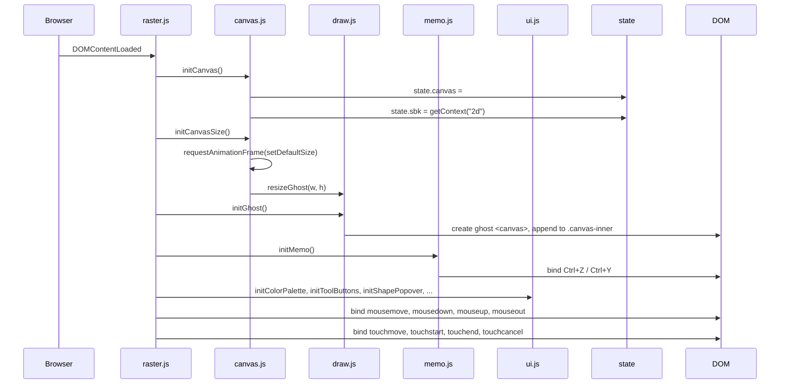
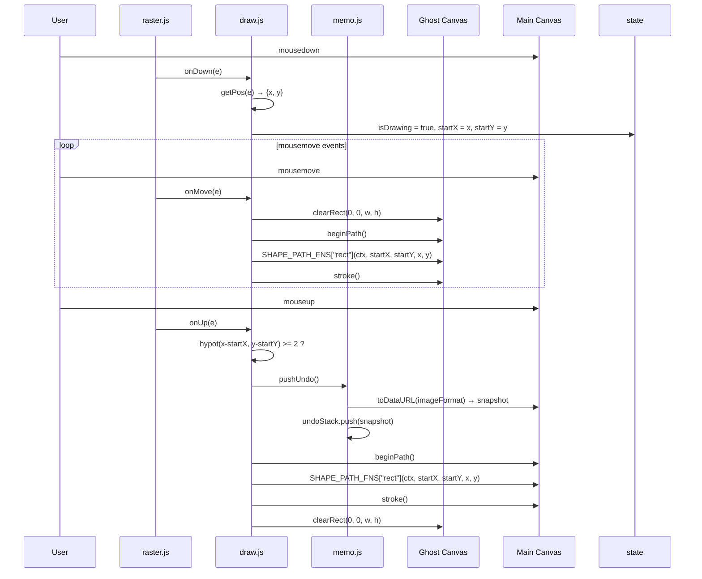
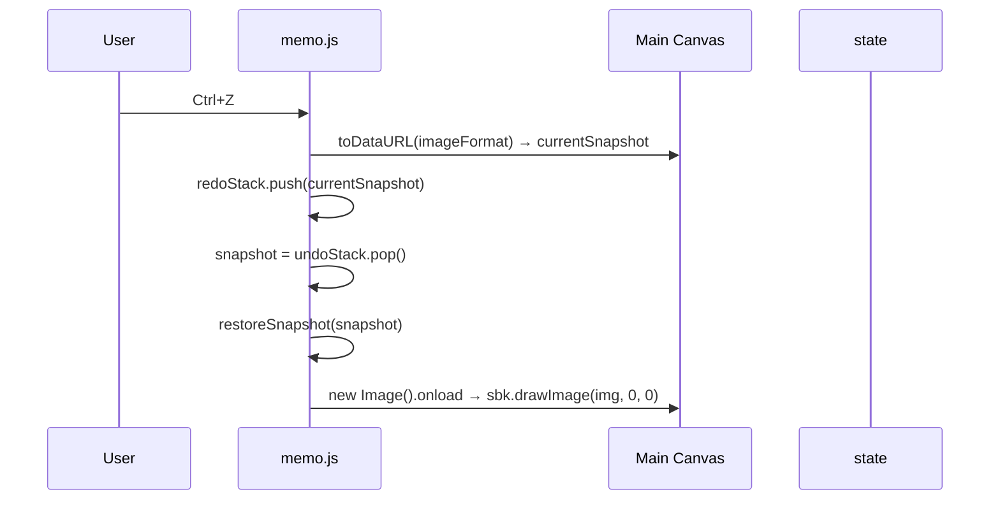
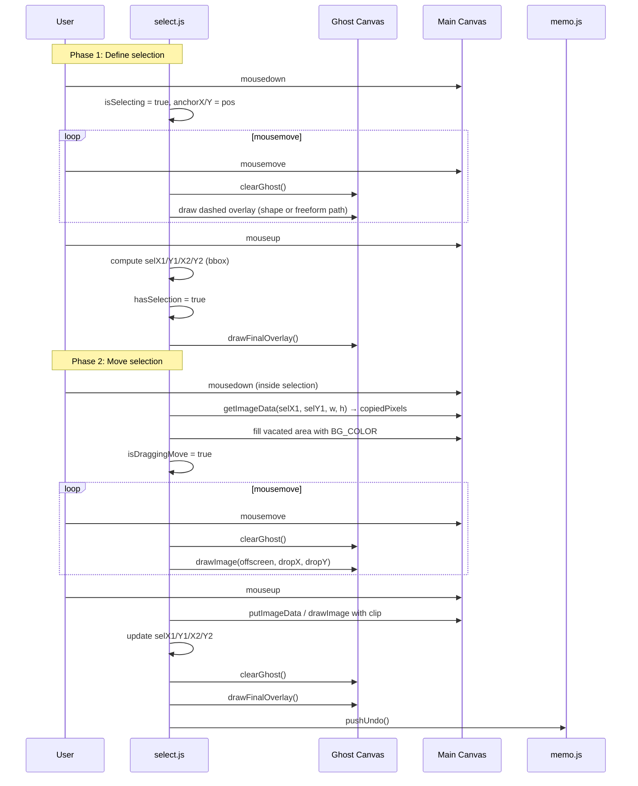
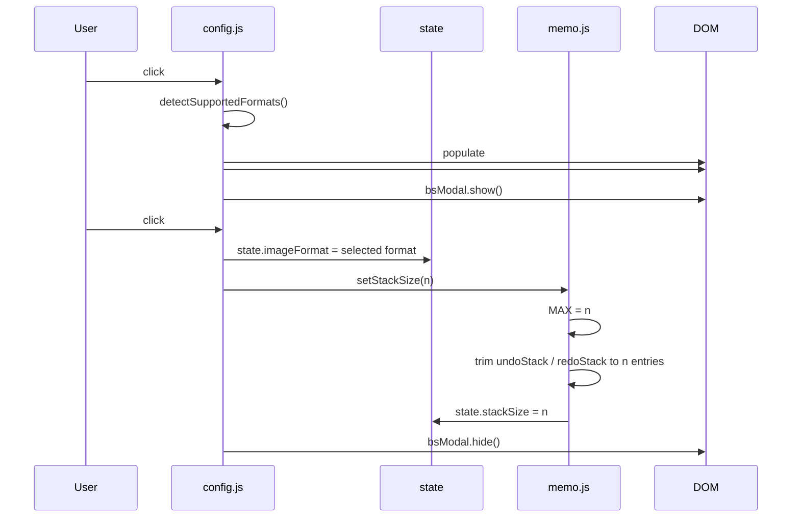

# Sabak — Data Flow and Interaction Sequences

This document describes the key data flows and interaction sequences in the Sabak application using prose and Mermaid diagrams.

---

## 1. Application Initialisation

When the page loads, `raster.js` is executed as an ES module. jQuery's `$(function(){})` defers all initialisation until the DOM is ready.



---

## 2. Drawing a Shape

The following sequence describes drawing a rectangle from mousedown to mouseup.



---

## 3. Undo Operation



---

## 4. Selection Tool — Define and Move



---

## 5. Config Modal — Apply Changes



---

## 6. State Object Lifecycle

The `state` object is the single source of truth for all runtime configuration. The diagram below shows which modules write to which fields.

```
state.canvas          ← canvas.js (initCanvas)
state.sbk             ← canvas.js (initCanvas)
state.tool            ← ui.js (setTool)
state.color           ← ui.js (setColor)
state.lineWidth       ← ui.js (initLineWidth → sync)
state.isDrawing       ← draw.js (onDown, onUp, onLeave)
state.recordMode      ← record.js (toggleRecordMode)
state.fontFace        ← text.js (initTextTool → $select.on("change"))
state.fontSize        ← text.js (initTextTool → $size.on("input"))
state.imageFormat     ← config.js (applyConfig)
state.stackSize       ← memo.js (setStackSize)
state.selectShapeMode ← select.js (initSelectTool → popover click)
                      ← select.js (onSelectDown — arrow guard)
```

All other modules read these fields but do not write them (with the exception of `state.isDrawing`, which is also read by `draw.js` to gate `onMove`).

---

## 7. Ghost Canvas Lifecycle

The ghost canvas is used by two independent subsystems. Their usage must not overlap.

| Subsystem | Uses ghost canvas when |
|---|---|
| `draw.js` | `state.isDrawing === true` and tool is a shape (not pen/eraser) |
| `select.js` | `state.tool === "select"` — during gesture, after finalise, during move drag |

Because `raster.js` dispatches pointer events exclusively to either `draw.js` or `select.js` based on `state.tool`, the two subsystems never use the ghost canvas simultaneously. The ghost is always cleared before use by both subsystems.

---

## 8. Recording Data Flow

```
Frame mode:
  canvas → toDataURL("image/webp") → frames[] → gallery (type: "frames")
                                              → playback ( animation)

Stream mode:
  canvas → captureStream(30fps) → MediaRecorder → Blob (video/webm)
                                                → gallery (type: "video")
                                                → playback (<video>)
```

The two modes share the same start/stop/toggle/save API surface in `record.js`, with the implementation delegated to `record-frame.js` and `record-stream.js` respectively.
